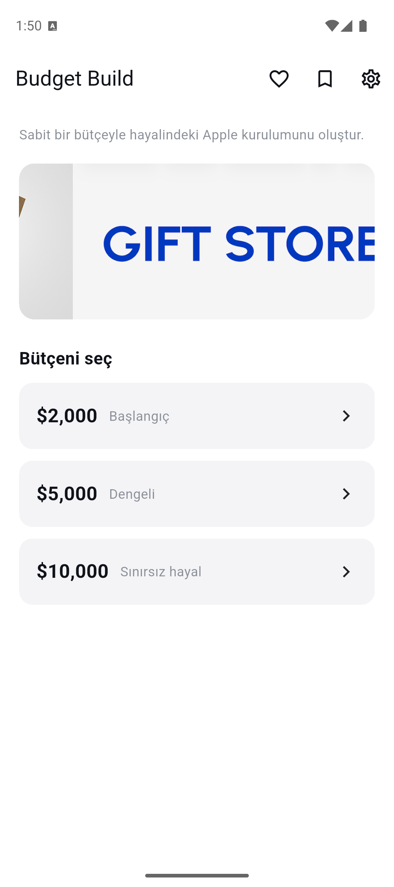
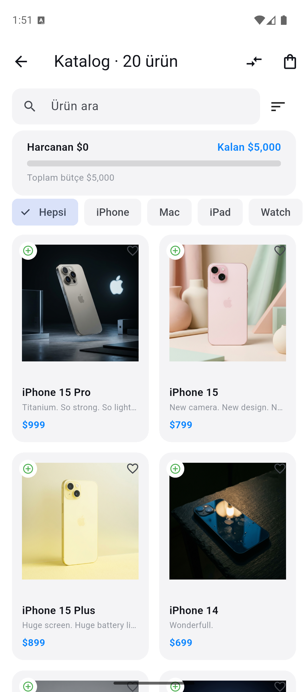
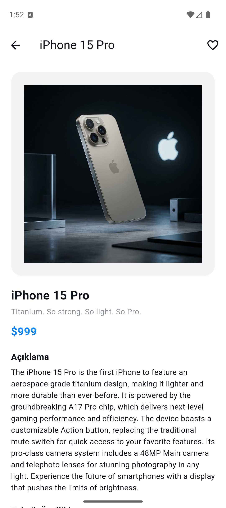
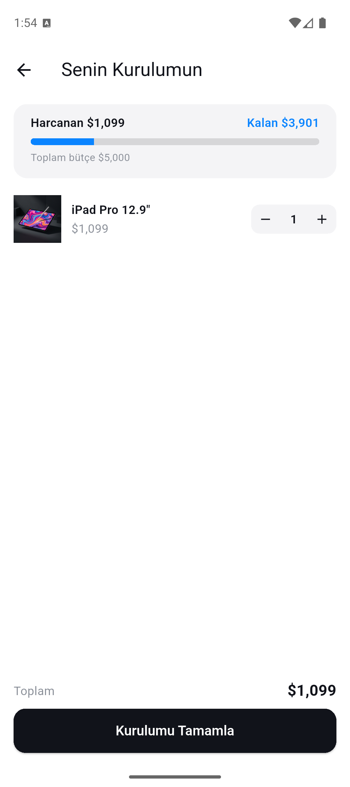
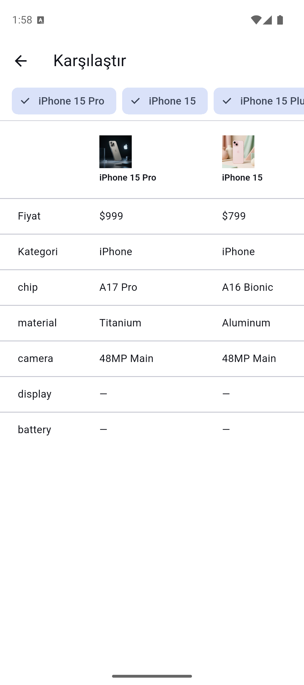
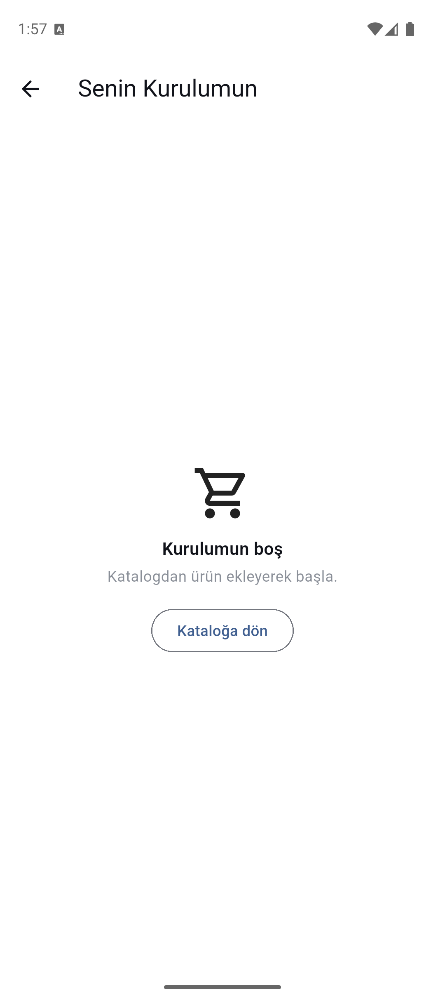
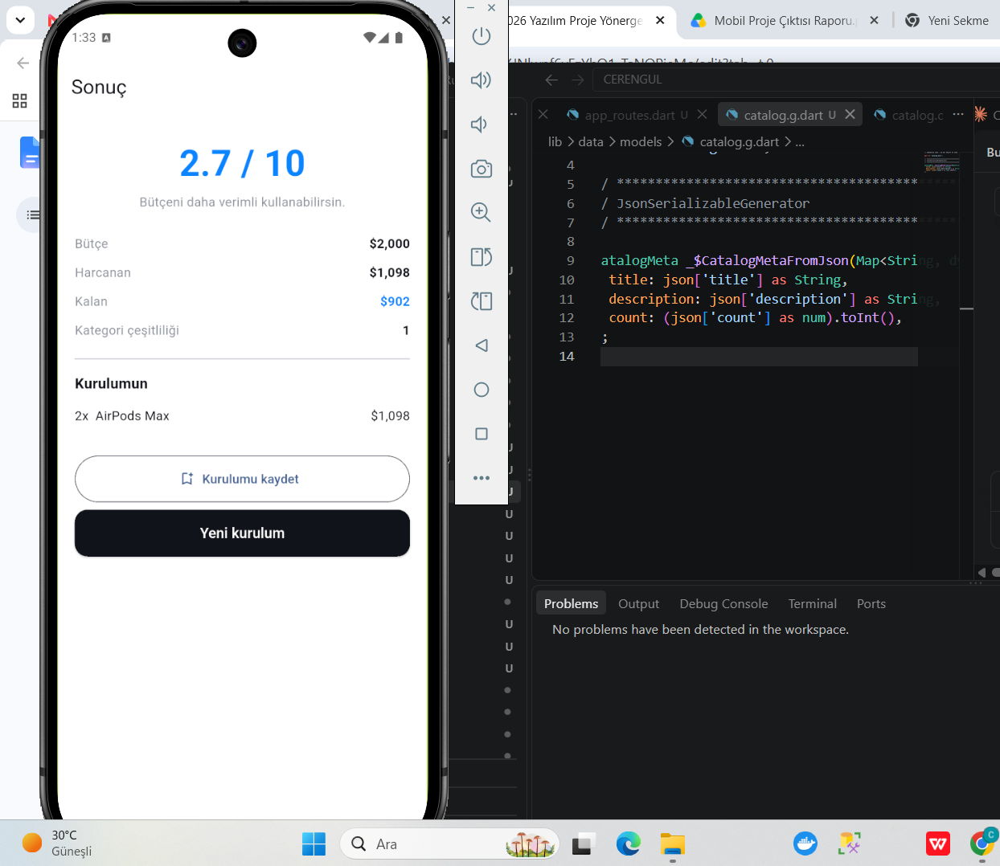
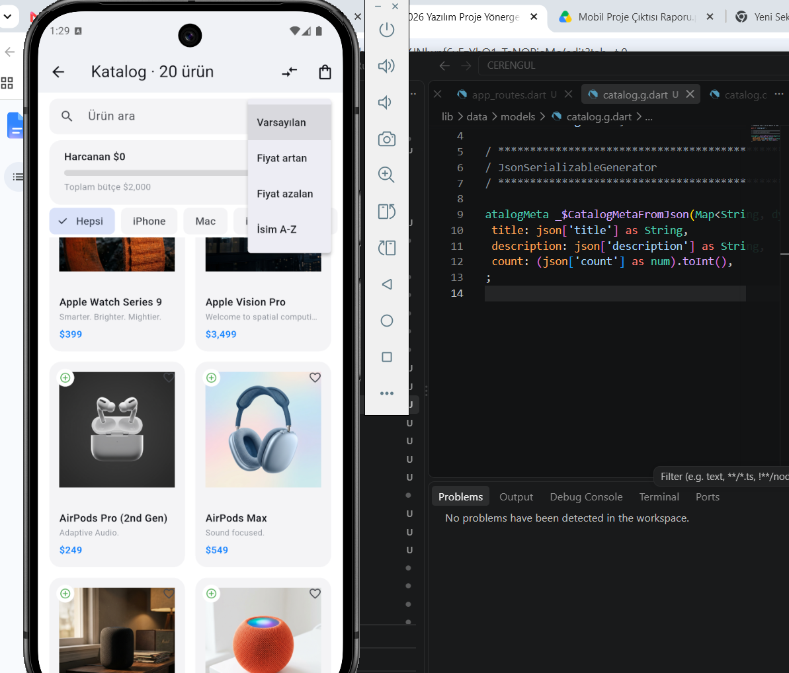
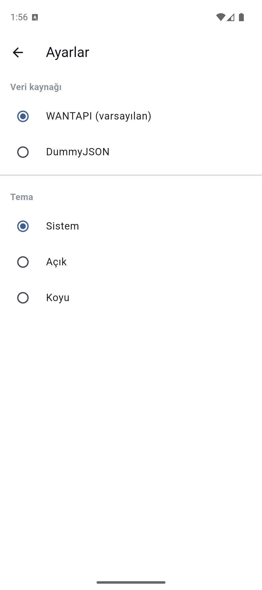

# Budget Build

**Kısa açıklama:** Sabit bir bütçeyle (örn. $2.000 / $5.000 / $10.000) hayalindeki
Apple kurulumunu oluşturan Flutter demo uygulaması. Kullanıcı katalogdan ürün
ekledikçe kalan bütçe anlık güncellenir, bütçeyi aşan ürünler kilitlenir ve
sonunda kurulumun "setup skoru" hesaplanır. Ürün verisi
[WANTAPI](https://wantapi.com/products.php) mock servisinden çekilir; internet
yoksa uygulamayla gelen yerel JSON'a düşülür.

> Eğitim ve demo amaçlıdır. Ürün adları ve markalar ilgili sahiplerine aittir;
> Apple Inc. ile bir bağlantısı yoktur.

## Kullanılan Flutter sürümü

| Araç | Sürüm |
| --- | --- |
| Flutter | **3.44.8** (stable) |
| Dart | 3.12.2 |
| Android compileSdk | Flutter varsayılanı (SDK 36) |

`.metadata` dosyasındaki revizyon: `058e0af2c2b57e369d905a03ac9748b0ebf543c6`.

## Ekran Görüntüleri

| Ana sayfa | Katalog | Ürün detayı |
| --- | --- | --- |
|  |  |  |

| Kurulum (sepet) | Karşılaştırma | Boş kurulum |
| --- | --- | --- |
|  |  |  |

| Sonuç (setup skoru) | Sıralama menüsü | Ayarlar |
| --- | --- | --- |
|  |  |  |

## Özellikler

- **Ana sayfa** – banner + bütçe seviyesi seçimi ($2K / $5K / $10K)
- **Katalog** – `GridView` kart tasarımı, arama, sıralama, kategori filtresi,
  shimmer yükleme iskeleti, pull-to-refresh
- **Ürün detayı** – görsel, açıklama, teknik özellikler; named route + **Route Arguments**
- **Kurulum (sepet)** – ekle/çıkar, adet, anlık bütçe ve toplam
- **Sonuç** – kategori çeşitliliği + bütçe kullanımına dayalı "setup skoru"
- **Karşılaştırma** – 3 ürüne kadar yan yana spec tablosu
- **Favoriler** ve **Kayıtlı Kurulumlar** – `shared_preferences` ile kalıcı
- **Ayarlar** – veri kaynağı (WANTAPI / DummyJSON) ve tema modu (sistem/açık/koyu)

## Mimari

```
lib/
  core/         sabitler, Result tipi, biçimlendirme
  data/
    models/     Product, Catalog, BuildItem, SavedBuild (json_serializable)
    sources/    WantApiSource, DummyJsonSource, LocalAssetSource (adapter)
    *_repository.dart
  providers/    BuildProvider, CatalogProvider, FavoritesProvider, ThemeProvider
  screens/      ekranlar
  widgets/      yeniden kullanılabilir bileşenler
  theme/        açık/koyu tema
  di.dart       get_it servis konumlandırıcı
```

- **State:** `provider` (`ChangeNotifier`)
- **Ağ:** `http`, kaynak hatalarında yerel asset'e fallback (`Result<T>`)
- **DI:** `get_it`
- **Kod üretimi:** `json_serializable` (`dart run build_runner build`)

## Çalıştırma adımları

```bash
# 1. Depoyu klonla
git clone https://github.com/iyteceren/MOBILEPROJECT.git
cd MOBILEPROJECT

# 2. Bağımlılıkları indir
flutter pub get

# 3. Kod üretimini çalıştır (json_serializable .g.dart dosyaları)
dart run build_runner build --delete-conflicting-outputs

# 4. Bir emülatör veya cihaz bağlıyken çalıştır
flutter run

# APK üretmek için:
flutter build apk --release
```

> `.g.dart` dosyaları depoda mevcut olduğundan 3. adım atlanabilir; yalnızca
> modeller değiştirilirse tekrar çalıştırılması gerekir.

## Test

```bash
flutter test
```

23 test: birim (model, `BuildProvider`, arama/sıralama, repository + `MockClient`)
ve widget testleri.

## Android

- `applicationId`: `com.cerengul.budgetbuild`
- Adaptive launcher icon + native splash (`flutter_launcher_icons`, `flutter_native_splash`)
- Release: R8 + resource shrink; `flutter build apk --split-per-abi` ile ABI başına APK

## Veri Kaynakları

| Kaynak | URL |
| --- | --- |
| WANTAPI (varsayılan) | `https://wantapi.com/products.php` |
| DummyJSON | `https://dummyjson.com/products` |
| Yerel yedek | `assets/data/products.json` |
